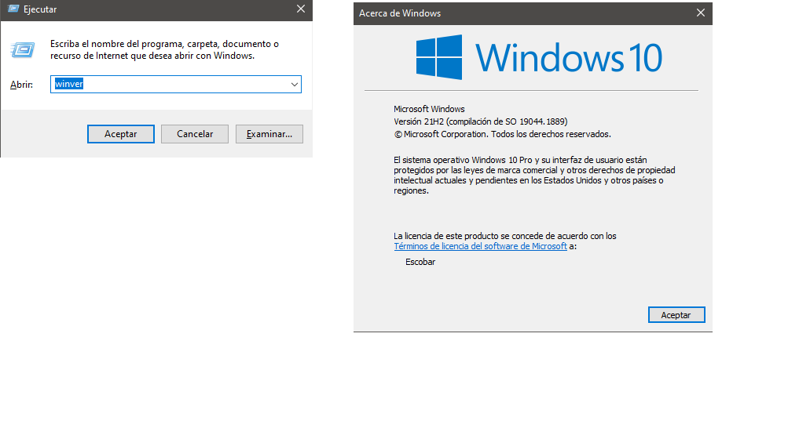

# __INSTALACIÓN DE WSL2 EN NUESTRO PC__
Para empezar con la instlacion de WSL2 __(*Windows Subsystem Linux*)__ es necesario comprobar que los requisitos de nuestro equipo esten aptos para trabajar sin ningun problema. 

Si no sabes cuales son los requisitos pulsa [aqui](https://github.com/LuisKrlos27/WSL2/tree/main/Informaci%C3%B3n)

Para saber que version de Windows tiene tu ordenador debes pulsar la tecla __Windows + R__ y escribir __WInver__

ya comprobado que nuestro ordenador cumpla con los requisitos el siguiente paso sera activar las funciones de __Hiper-V, Plataforma de maquina virtual y Subsistema de Windows para Linux.__

Esto se hace de la siguiente manera:

* Pulsar la tecla __Windows__ y escribir __Panel de control__ y __abrir__
.png)

* Dentro de panel de control en la parte superior derecha hay una opcion llamada __Ver por: *Categoria*__ 
.png)
y la cambiaremos a __Iconos grandes__
.png)
posteriormente daremos clic en la opcion que se llama __Programas y Caracteristicas__
.png)

* Luego de entrar a __Programas y Caracteristicas__ apareceran todos nuestros programas instalados en el sistema.
En la parte superior izquierda daremos clic en la opcion que se llama __Activar o desactivar las caracteristicas de Windows__ 
.png)
