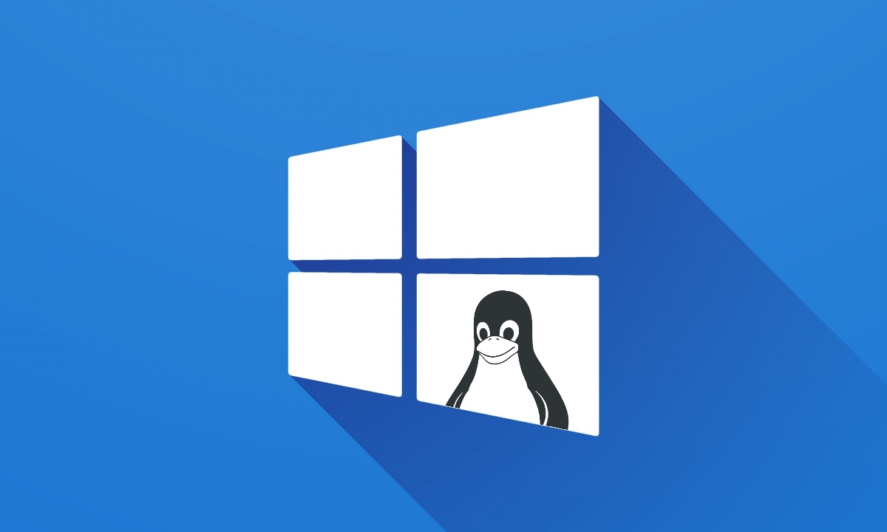

# WWSL2
# CATALINA APLASTA PLATANOS CON LA FRENTE ❤❤

## Windows Subsystem Linux
- Es una capa de compatibilidad desarrollada por Microsoft para correr ejecutables de Linux nativamente en Windows 10 y Windows Server 2019. A partir de junio de 2019 está disponible WSL versión 2, el cual incorpora cambios importantes, como el uso de un núcleo Linux real.​

- Es una característica introducida en Windows 10 que nos permite instalar un Kernel Linux directamente sobre el sistema operativo de Microsoft.

## Mas informacion sobre WSl2

1. [Información][info]

[info]:https://github.com/LuisKrlos27/WSL2/tree/main/Informaci%C3%B3n

2. [Ventajas][vent]

[vent]:https://github.com/LuisKrlos27/WSL2/blob/main/Ventajas

3. [Instalación][insta]

[insta]:https://github.com/LuisKrlos27/WSL2/blob/main/Instalación